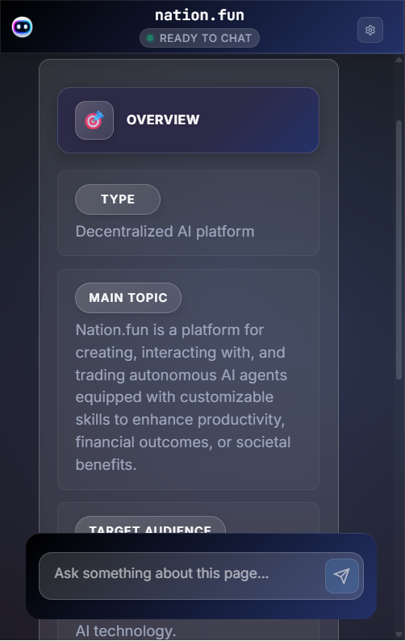
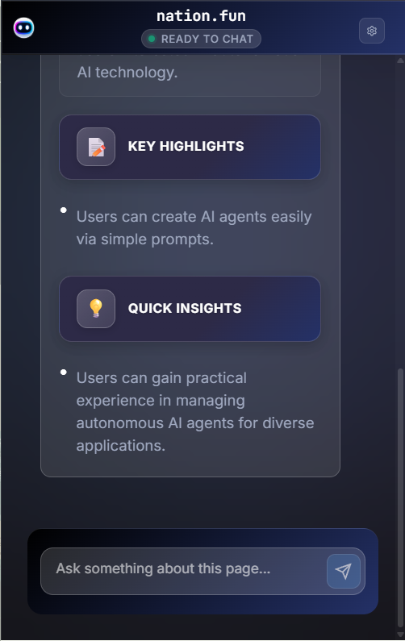

# Site Scout AI - Intelligent Web Analysis Extension

<div align="center">
  
  <br>
  <em>AI-Powered Web Research Agent powered by nation.fun</em>
</div>

> **AI-Powered Web Research Agent** - Transform your browsing experience with intelligent web page analysis, automated content indexing, and contextual AI chat capabilities. Powered by **nation.fun** AI technology.

[](https://github.com/envexx/site-scout)
[](LICENSE)
[](https://chrome.google.com/webstore)
[](https://developer.chrome.com/docs/extensions/mv3/)
[](https://nation.fun)
[](https://youtu.be/vOsI0_nHO4A?si=eIwKEBugoziQELqg)

## 🌟 What is Site Scout AI?

**Site Scout AI** is a sophisticated Chrome browser extension that leverages **nation.fun** artificial intelligence to revolutionize how you interact with web content. It automatically analyzes web pages, provides comprehensive summaries, and enables intelligent conversations about any webpage content through an advanced AI chat interface powered by nation.fun's cutting-edge AI technology.

<h2>UI UPDATE</h2>
<p>
  <div style="display: flex; justify-content: space-around; align-items: center;">
   
      
 

   
      

  
 
      <iframe width="300" height="169" src="https://www.youtube.com/embed/vOsI0_nHO4A" frameborder="0" allow="accelerometer; autoplay; clipboard-write; encrypted-media; gyroscope; picture-in-picture" allowfullscreen></iframe>

  </div>
</p>


### 🆕 **Version 1.2.0 - Major Updates**
- ✨ **Enhanced AI Response Formatting** - Intelligent detection and formatting of AI responses
- 🎯 **Smart Question Routing** - Automatic detection between website analysis and normal chat
- 🎨 **Improved Chat Interface** - Better message layout with user messages on right, AI on left
- 🔧 **Advanced Error Handling** - Robust fallback systems for crawling failures
- 📱 **Optimized UI/UX** - Cleaner interface with better message organization

### ✨ Key Features

- 🤖 **AI-Powered Analysis** - Automatic web page content understanding and indexing powered by nation.fun
- 💬 **Interactive AI Chat** - Contextual conversations about webpage content using nation.fun AI
- 🎨 **Modern Interface** - Beautiful glassmorphism design with smooth animations
- 📊 **Smart Indexing** - Intelligent content processing and pattern recognition via nation.fun
- 🔒 **Privacy First** - Local processing when possible, secure API communication with nation.fun
- 📱 **Responsive Design** - Works perfectly on all devices and screen sizes
- 🎯 **Smart Question Detection** - Automatically routes questions to appropriate AI analysis mode
- ✨ **Enhanced Response Formatting** - Beautiful, structured AI responses with intelligent formatting
- 🔄 **Robust Error Handling** - Multiple fallback strategies for reliable operation

## 🚀 Quick Start

**🎥 [Watch Demo & Tutorial Video](https://youtu.be/vOsI0_nHO4A?si=eIwKEBugoziQELqg)**

### 📥 Download & Installation

1. **Download the Extension**
   - 📦 **[Download from Google Drive](https://drive.google.com/drive/folders/1rWhn8ccg27s1tRLSJnhXF5V6kJS8kGpu)**
   - Extract the downloaded ZIP file to your desired location

2. **Load Extension in Chrome**
   - Open `chrome://extensions/` in your browser
   - Enable "Developer mode" (toggle in top right)
   - Click "Load unpacked" → select the extracted project folder

3. **API Key Already Configured**
   - No need to manually enter or configure API key.
   - Site Scout AI is ready to use immediately with embedded API key.

### 🎯 First Use

1. **Navigate** to any web page you want to analyze
2. **Click** the Site Scout AI icon in your browser toolbar
3. **Wait** for automatic analysis to complete (typically 10-60 seconds)
4. **Read** the comprehensive AI-generated summary powered by nation.fun
5. **Ask** follow-up questions about the content through the chat interface

## 🏗️ Project Architecture

### 📁 Directory Structure

```
site-scout/
├── 📄 manifest.json                    # Chrome extension configuration (MV3)
├── 📁 icons/                           # Extension icons (16x16, 48x48, 128x128)
│   ├── logo.png                        # Main extension logo
│   ├── icon16.png                      # 16x16 extension icon
│   ├── icon48.png                      # 48x48 extension icon
│   └── icon128.png                     # 128x128 extension icon
├── 📁 src/                             # Source code
│   ├── 📁 popup/                       # Main extension popup interface
│   │   ├── popup.html                  # Popup HTML structure
│   │   ├── popup.js                    # Main popup logic & UI interactions
│   │   ├── style.css                   # Popup styling
│   │   ├── analysis-loading.html       # Analysis loading interface
│   │   ├── analysis-loading-controller.js # Loading controller logic
│   │   ├── robot-loading.html          # Robot animation interface
│   │   ├── robot-loader.js             # Robot loading animation controller
│   │   ├── animation-controller.js     # Animation management
│   │   ├── animate.html                # Animation testing interface
│   │   └── test-robot-loader.html      # Robot loader testing
│   ├── 📁 settings/                    # Configuration and settings panel
│   │   ├── settings.html               # Settings page structure
│   │   ├── settings.css                # Settings styling
│   │   └── settings.js                 # Settings management logic
│   ├── 📁 background/                  # Service worker (MV3)
│   │   └── background.js               # Background tasks & API management
│   └── 📁 lib/                         # Core libraries and utilities
│       ├── api_handler.js              # nation.fun API integration
│       └── storage_manager.js          # Chrome storage wrapper
├── 📁 landing-page/                    # Project landing page
│   ├── index.html                      # Main landing page
│   └── 📁 picture/                     # Landing page images
│       ├── logo.png                    # Landing page logo
│       ├── nation.png                  # nation.fun branding
│       ├── analyzing.png               # Analysis feature preview
│       ├── chat.png                    # Chat feature preview
│       ├── Features.png                # Features preview
│       └── Setup.png                   # Setup configuration preview
├── 📁 animation/                       # Animation testing and development
│   └── index.html                      # Animation test interface
├── 📄 README.md                        # This file
├── 📄 package.json                     # Node.js dependencies
├── 📄 package-lock.json                # Locked dependency versions
├── 📄 test_api.js                      # API testing utilities
└── 📄 site-scout-nation.zip            # Distribution package
```

### 🔧 Technical Stack

- **Frontend**: HTML5, CSS3, JavaScript (ES6+)
- **Extension**: Chrome Extension Manifest V3
- **AI Integration**: **nation.fun** AI Agent API
- **Storage**: Chrome Storage API
- **Design**: Modern CSS with glassmorphism effects
- **Animations**: Hardware-accelerated CSS animations
- **Package Management**: Node.js with npm

## 🎯 Core Features

### 🤖 **AI-Powered Web Analysis (Powered by nation.fun)**

| Feature | Description |
|---------|-------------|
| **Intelligent Content Understanding** | Automatically analyzes web page content, structure, and context using nation.fun's advanced NLP |
| **Smart Indexing** | Processes and indexes web pages for AI comprehension, identifying key information via nation.fun |
| **Pattern Recognition** | Detects navigation elements, content hierarchy, and important sections using nation.fun AI |
| **Real-time Processing** | Live analysis with progress tracking and status updates powered by nation.fun |

### 💬 **Interactive AI Chat Interface (nation.fun AI)**

| Feature | Description |
|---------|-------------|
| **Contextual Conversations** | Chat with nation.fun AI about the current webpage content |
| **Real-time Responses** | Get instant answers and insights about page elements from nation.fun |
| **Smart Suggestions** | nation.fun AI provides relevant questions and analysis prompts |
| **Chat History** | Persistent conversation history per website |
| **Smart Question Routing** | Automatically detects website analysis vs. normal chat questions |
| **Enhanced Response Formatting** | Beautiful, structured responses with intelligent formatting |
| **Improved Chat Layout** | User messages on right, AI responses on left for better UX |

### 🎨 **Modern User Interface**

| Feature | Description |
|---------|-------------|
| **Glassmorphism Design** | Contemporary glass-like interface with backdrop filters |
| **Responsive Layout** | Mobile-first design that adapts to all screen sizes |
| **Dark Theme** | Professional dark color scheme with gradient accents |
| **Smooth Animations** | Elegant transitions and micro-interactions throughout |

### 📊 **Advanced Robot Loading System**

| Feature | Description |
|---------|-------------|
| **Custom Animated Robot** | Unique floating robot design with orbital energy particles |
| **Progress Visualization** | Animated progress bars and status indicators |
| **Interactive Elements** | Mouse-responsive animations and dynamic status updates |
| **Hardware Acceleration** | GPU-optimized animations for smooth performance |

### 🔧 **Enhanced Error Handling & Fallback Systems**

| Feature | Description |
|---------|-------------|
| **Smart Retry Logic** | Multiple fallback strategies for crawling failures |
| **Manual Analysis Generation** | Provides analysis when automated crawling fails |
| **Graceful Degradation** | Continues to function even with technical limitations |
| **User-Friendly Error Messages** | Clear communication about issues and solutions |

## 🔄 How It Works

### 1. **Content Analysis Flow (nation.fun Integration)**
```
User Opens Extension → nation.fun AI Agent Initializes → Content Crawling → Analysis Processing → Summary Generation → Chat Ready
```

### 2. **Analysis Stages**
1. **🔄 Initialize (15%)** - Setup nation.fun AI agent connection and prepare analysis
2. **🕷️ Crawling (40%)** - Extract and process page content
3. **🧠 Processing (80%)** - nation.fun AI analysis and content structuring
4. **✅ Finalizing (95%)** - Format summary and prepare chat interface
5. **🎉 Complete (100%)** - Display results and enable interactions

### 3. **Chat Interaction Flow (nation.fun AI)**
```
User Question → Smart Detection → Route to Analysis/Chat → nation.fun AI Processing → Response Generation → Display Answer → Save to History
```

### 4. **Smart Question Routing System**
```
Question Input → Keyword Analysis → Website Analysis Mode (with formatting) OR Normal Chat Mode → AI Response → Format & Display
```

## 🎯 Use Cases

### 👨‍💻 **For Developers**
- **Code Analysis**: Understand complex web applications and code structures
- **Debugging Assistance**: Get AI insights on web page issues and errors
- **Learning Tool**: Learn about web technologies and implementation patterns
- **API Documentation**: Quick understanding of complex technical docs
- **Technical Research**: Get structured analysis of technical documentation

### 🎯 **For Content Analysts**
- **Website Analysis**: Comprehensive breakdown of website structure and content
- **Content Strategy**: Understand content organization and user experience patterns
- **Competitive Research**: Analyze competitor websites with AI-powered insights
- **SEO Analysis**: Get AI insights on content structure and optimization

### 🔬 **For Researchers**
- **Content Analysis**: Extract and analyze information from research papers
- **Data Collection**: Gather insights from multiple web sources
- **Pattern Recognition**: Identify trends and patterns in web content
- **Literature Review**: Quick summaries of academic papers

### 💼 **For Business Users**
- **Competitive Analysis**: Analyze competitor websites and strategies
- **Market Research**: Gather insights from industry websites and news
- **Content Strategy**: Understand content organization and user experience
- **Product Research**: Quick analysis of product features and specifications

### 📚 **For General Users**
- **Learning Enhancement**: Get explanations of complex topics on any webpage
- **Navigation Help**: Find specific information quickly on large websites
- **Content Summarization**: Get AI-generated summaries of long articles
- **Research Assistant**: Intelligent help for any web-based research


## 📊 Performance Metrics

| Metric | Value | Description |
|--------|-------|-------------|
| **Analysis Time** | 10-60 seconds | Time to complete full page analysis |
| **Response Time** | 5-15 seconds | AI chat response generation time |
| **Accuracy** | 85-95% | Content analysis accuracy rate |
| **Supported Sites** | 95%+ | Percentage of websites that work |
| **Memory Usage** | < 50MB | Extension memory footprint |
| **Load Time** | < 2 seconds | Extension popup load time |
| **Error Recovery Rate** | 90%+ | Success rate of fallback strategies |
| **Question Routing Accuracy** | 95%+ | Accuracy of smart question detection |

## 🔒 Security & Privacy

### ✅ **Security Features**
- **API Key Encryption**: Secure storage in Chrome's encrypted storage
- **HTTPS Only**: All API communications use secure protocols
- **Minimal Permissions**: Only necessary permissions requested
- **Local Processing**: Content analysis happens locally when possible

### 🛡️ **Privacy Protection**
- **No Data Collection**: No user data collected beyond necessary functionality
- **Local Storage**: Chat history stored locally on user's device
- **API Privacy**: Only sends necessary data to AI service
- **User Control**: Full control over data and settings

### 📋 **Required Permissions**
```json
{
  "permissions": [
    "storage",        // Data persistence
    "activeTab",      // Current tab access
    "scripting",      // Content script injection
    "notifications"   // System notifications
  ]
}
```


## 📄 License

This project is licensed under the **MIT License** - see the [LICENSE](LICENSE) file for details.

**MIT License Benefits:**
- ✅ Commercial use allowed
- ✅ Modification and distribution allowed
- ✅ Private use allowed
- ✅ Patent use allowed
- ✅ Only requires license and copyright notice

## 📞 Contact Information

- **Project Email**: coresolution3@gmail.com
- **GitHub**: [@envexx](https://github.com/envexx)
- **Website**: [https://site-scout.vercel.app/](https://site-scout.vercel.app/)


---

## 🚀 Get Started

1. **[Download](https://drive.google.com/drive/folders/1rWhn8ccg27s1tRLSJnhXF5V6kJS8kGpu)** the extension
2. **No API key configuration needed**
3. **Start immediately** analyzing web pages with AI

---

**Built with ❤️ and 🤖 for Hackathon**

*Site Scout AI - AI-powered web analysis extension* 🕷️✨

---

*Hackathon Project | Version: 1.2.0*
